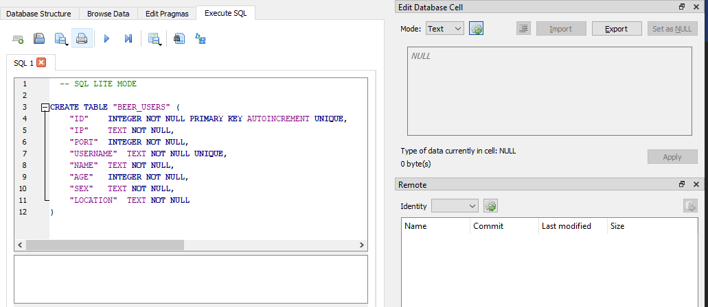

## Beer meeting

Proyecto piloto para el curso de redes definidas por software SDN, en este proyecto se implementa una aplicación
de chat que implementa los conceptos de sockets aprendidos en el curso junto la buenas prácticas de programación que
promueve la línea de modelamiento del grupo de investigación GITA.

### Requisitos

- Python 3
- SO que soporte la librería multithreading de Python (Windows, MAC o Linux)
- Oracle 11g o superior (RECOMENDADO, en caso no tener oracle es necesario re hacer la clase Database para usar otro
 driver de conexión a la base de datos).

### Librerías usadas

- socketserver
- logging
- cx_Oracle
- pickle

### Instalación

Verificamos que tengamos una versión de Python 3 mediante el comando 

```bash
python --version 
python3 --version
```

Nota: En algunos casos es posible que el equipo tenga instalado python 3 apuntando al comando python3.

Después de tener listo python pasamos a instalar nuestro motor de base de datos, para el caso por defecto se usa Oracle
18c, sin embargo para facilitar el uso por parte de terceros es posible usar el motor SQLite. 

#### Modificación Oracle por SQLite

Creamos una base de datos mediante 
[SQLiteBrowser](https://sqlitebrowser.org/blog/portableapp-for-3-11-2-release-now-available/) o cualquier medio que 
permita gestionar bases de datos SQLite.




Una vez creada modificamos beer_server de la siguiente manera:

```python
from socketserver import ThreadingMixIn, TCPServer
from beermeeting.database import Database


class BeerServer(ThreadingMixIn, TCPServer):

    def __init__(self, server_address, RequestHandlerClass, config, bind_and_activate=True):
        super().__init__(server_address, RequestHandlerClass, bind_and_activate)
        # Database.get_instance(config.username, config.password, config.dsn)
        Database.get_instance(None, None, 'url_database.sql', 2)            

```

Nota: Donde va url_database, se debe colocar la ruta donde se encuentra creada la base de datos que iniciamos mediante
SQLiteBrowser.

### Pasos para ejecutar el proyecto

- Llamamos el BeerServer, así: 

```python
from beermeeting.server import BeerServer
from beermeeting.request import EchoRequestHandler
import config
import logging

logging.basicConfig(level=logging.DEBUG,
                    format='%(name)s: %(message)s',
                    )

    address = ('localhost', 9999)  # let the kernel assign a port
    server = BeerServer(address, EchoRequestHandler, config)
    server.serve_forever()

```

-  Ejecutamos tantos clientes como deseemos:

 ```python
from beermeeting.client import Client


if __name__ == "__main__":
    c = Client()
    c.run()


```

Es posible ajustar el proyecto para que soporte cualquier base de datos SQL al modificar el modulo Database.


### ¿Cómo contribuir?

Este proyecto es una prueba piloto de para la tesis de grado "Metodologá de diseño software para proyectos en el
grupo de investigación GITA. ", por ende, la contribución a dicho proyecto depende de los encargados del mismo.

### Contacto

Edward Nicolas Montoya Arcila - edward.montoya@udea.edu.co